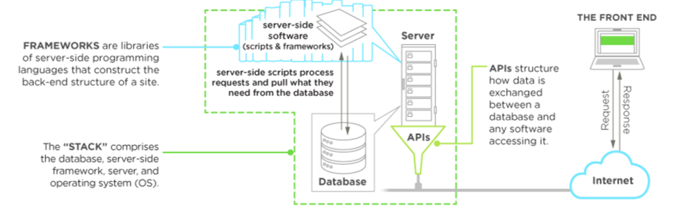

[&#8592; Zurück zur Übersicht](..)

# Allgemeines

Das Backend ist ein **Mix** bestehend aus **Server, Datenbank, API und operativen Systemen**. Es führt quasi die Befehle aus, die vom Frontend zu ihm durch gegeben werden. Hauptsächlich verantwortlich für die Steuerung der Datenspeicherung /-organisation und der Funktionalität des Programmes. Metaphorisch kann man also behaupten, es ist das "Gehirn" des Programm.

Der Backend-Code fügt die Nutzbarkeit zu allem, was aus dem Frontend-Code ankommt, hinzu. Die genutzte Sprache kann auf Web-Servern, Cloud-basierten Servern oder einer Hybridkombination aus beidem laufen. Die serverseitige Arbeitslast kann hierbei auf verschiedene Maschinen verteilt werden.

Die Anwendung interagiert per **API** direkt mit der genutzten Datenbank. Die API gibt die Struktur an, wie die Daten zwischen Backend und Frontend ausgetauscht werden, um die Daten in der Datenbank zu laden, speichern oder zu ändern.

Diese eingegebenen Daten werden im Anschluss in Frontend-Code konvertiert und zurückgegeben, damit der User weitere Interaktionen innerhalb des Programmes durchführen kann.

Für die Verbindung zwischen Front- und Backend bedarf es der sogenannten **Middleware**. Sie verteilt die Anfragen des Frontend-Bereichs zu den gewünschten Methoden des Backend-Bereichs, um das gewünschte Resultat auszugeben.

## Quellen

https://www.upwork.com/

## Autoren

| Name         | E-Mail                          | Änderungsdatum |
|:-------------|:--------------------------------|:---------------|
| Stefan Settertobulte | ssettert@smail.uni-koeln.de | 20.03.2019     |
