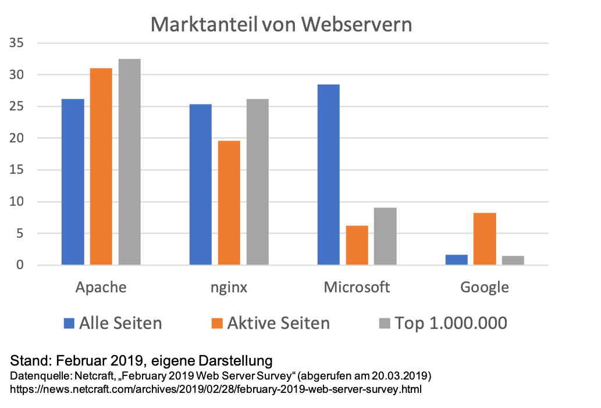

[&#8592; Zurück zur Übersicht](..)

# Webserver

## Definition / Allgemeines
Ein Webserver ist ein Server, der **Anfragen** über das Internet von Webclients/Browsern annimmt und Daten und Inhalte zum Abrufen bereitstellt.

	

## Arbeitsweise
Der Client stellt eine HTTP-Anfrage an den Server: `GET https://www.example.com`.  
Statische Webseiten (HTML-Dateien) werden direkt vom Webserver an den Client ausgeliefert.  
Wenn es sich um eine **dynamische Seite** handelt (bsp. PHP-Dateien), wird ein zusätzliches Modul benötigt, dass das entsprechende Skript ausführt und die Inhalte erst beim Aufruf aus **unterschiedlichen Quellen** zusammengestellt.

## Gängige Webserver
Es werden nur die vier am häufigsten verwendeten Webserver behandelt: Apache, nginx, Microsoft und Google.

	

Es ist erkennbar, dass der Microsoft-Server allgemein betrachtet zwar am häufigsten verwendet wird, bei aktuellen und häufig besuchten Seiten jedoch kaum noch eine Rolle spielt. Die Apache- und nginx-Server bilden die Marktführer bei den aktuellen Seiten.

### Apache

 
Lorem ipsum dolor sit amet, consectetur adipiscing elit. Si sapiens, ne tum quidem miser, cum ab Oroete, praetore Darei, in crucem actus est. Sunt enim prima elementa naturae, quibus auctis vírtutis quasi germen efficitur. Eam si varietatem diceres, intellegerem, ut etiam non dicente te intellego; <i>Id enim natura desiderat.</i> Beatus autem esse in maximarum rerum timore nemo potest. 

### nginx

 
Lorem ipsum dolor sit amet, consectetur adipiscing elit. Si sapiens, ne tum quidem miser, cum ab Oroete, praetore Darei, in crucem actus est. Sunt enim prima elementa naturae, quibus auctis vírtutis quasi germen efficitur. Eam si varietatem diceres, intellegerem, ut etiam non dicente te intellego; <i>Id enim natura desiderat.</i> Beatus autem esse in maximarum rerum timore nemo potest. 

### Microsoft

https://upload.wikimedia.org/wikipedia/commons/c/c5/Nginx_logo.svg
### 

## Quellen
- [botfrei Blog: "Know-How: Was ist ein Webserver?"](https://blog.botfrei.de/2013/01/webserver-die-qual-der-wahl/) (abgerufen am 20.03.2019)
- [Netcraft: "February 2019 Web Server Survey"](https://news.netcraft.com/archives/2019/02/28/february-2019-web-server-survey.html) (abgerufen am 20.03.2019)

## Autoren
| Name       | E-Mail                    | Änderungsdatum |
|------------|---------------------------|----------------|
| Felix Graf | fgraf4@smail.uni-koeln.de | 20.03.2019     |
