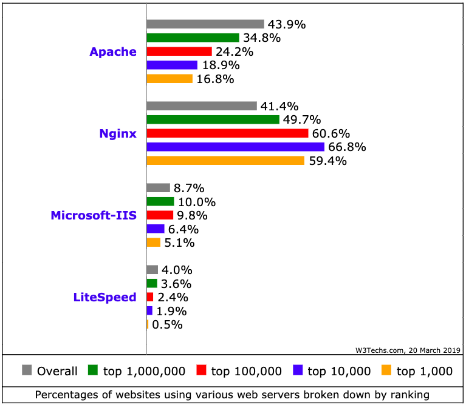

[&#8592; Zurück zur Übersicht](..)

# Webserver

## Definition / Allgemeines
Ein Webserver ist ein Server, der **Anfragen** über das Internet von Webclients/Browsern annimmt und Daten und Inhalte zum Abrufen bereitstellt.

## Arbeitsweise
Der Client stellt eine HTTP-Anfrage an den Server: `GET https://www.example.com`.  
Statische Webseiten (HTML-Dateien) werden direkt vom Webserver an den Client ausgeliefert.  
Wenn es sich um eine **dynamische Seite** handelt (bsp. PHP-Dateien), wird ein zusätzliches Modul benötigt, dass das entsprechende Skript ausführt und die Inhalte erst beim Aufruf aus **unterschiedlichen Quellen** zusammengestellt.

## Gängige Webserver

Es gibt einige verschiedene Webserver-Software. Jedoch werden im Folgenden nur drei Server behandelt. 
Vorweg ist zu sagen, dass es auch möglich ist, mehrere **Server zu kombinieren**, um die verschiedenen Vorteile der jeweiligen Server optimal auszuschöpfen.  
Es ist erkennbar, dass der **Apache**-Server weltweit am häufigsten verwendet wird, dicht gefolgt vom **NGINX**-Server. Allerdings findet NGINX bei Websiten, die viel Traffic vorzuweisen haben, signifikant mehr Anwendung als alle anderen.

### Apache

- einer der ältesten und meistbenutzten Webserver
- erste Version: 1995
- Open-Source, kostenfrei
- läuft auf allen gängigen Betriebssystemen
- kann durch viele Module erweitert werden
- Bietet Unterstützung für Programmiersprachen wie PHP, Python, Ruby

### nginx

- relativ neuer Webserver, der immer mehr an Bedeutung gewinnt
- erste Version: 2004
- läuft auf allen gängigen Betriebssystemen
- modular aufgebaut, vielfältig erweiterbar
- wird vor allem auf hochfrequentierten Websiten verwendet
  - beherrscht Lastenverteilung
  - hohe Leistung und gut konfigurierbar

### Node.js

- serverseitige Plattform zum Ausführen der eigentlich als Front-End-Sprache geltende Sprache JavaScript
- erste Version: 2009
- läuft auf allen gängigen Betriebssystemen
- besonderer Fokus liegt auf Performance
  - ressourcensparende Architektur
  - ermöglicht besonders große Anzahl gleichzeitiger Verbindungen
- durch sehr viele Module/Pakete erweiterbar, werden durch Paketmanager [npm](https://www.npmjs.com/) verwaltet

## Quellen
- [botfrei Blog: "Know-How: Was ist ein Webserver?"](https://blog.botfrei.de/2013/01/webserver-die-qual-der-wahl/) (abgerufen am 20.03.2019)
- [Netcraft: "February 2019 Web Server Survey"](https://news.netcraft.com/archives/2019/02/28/february-2019-web-server-survey.html) (abgerufen am 20.03.2019)
- [NodeCode - Was ist Node.js?](http://nodecode.de/was-ist-nodejs) (abgerufen am 20.03.2019)
- [Wikipedia: Apache HTTP Server](https://de.wikipedia.org/wiki/Apache_HTTP_Server) (abgerufen am 20.03.2019)
- [NGINX Wiki](https://www.nginx.com/resources/wiki/) (abgerufen am 20.03.2019)

## Autoren
| Name       | E-Mail                    | Änderungsdatum |
|------------|---------------------------|----------------|
| Felix Graf | fgraf4@smail.uni-koeln.de | 20.03.2019     |
